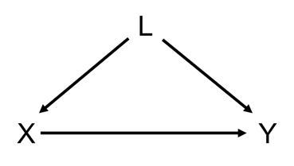
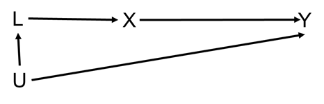
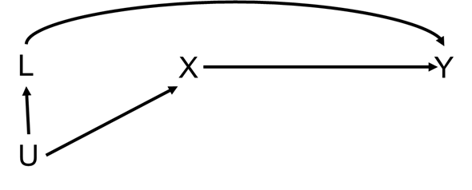
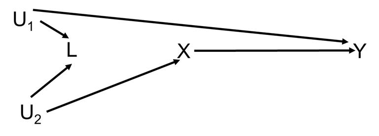
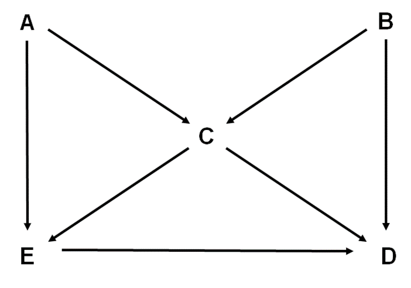
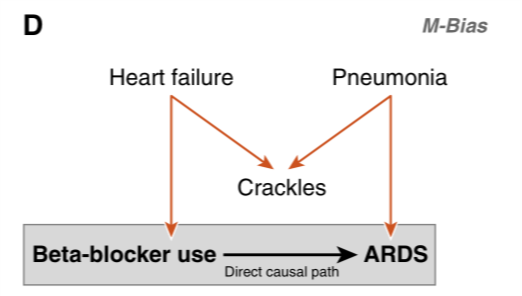

```{r setup, include=FALSE, warning=FALSE, results=FALSE}
knitr::opts_chunk$set(out.width = "50%")
library(tidyverse)
require(dagitty)
require(Hmisc)
require(ggdag)
require(DiagrammeR)
```

## Refresher

Notation: exposure $X$, outcome $Y$

* Pathway

```{r, echo=FALSE}
DiagrammeR::grViz("
      digraph mediator {
      graph [rankdir=TB]
      node [shape=plaintext, height=0.3, width=0.3]
      X [label=<<I>X</I>>]
      Y [label=<<I>Y</I>>]
      { rank = same; X Y }
      X -> Y [minlen=3]
      }
      ", height = 75)
```

* Mediator:

```{r, echo=FALSE}
DiagrammeR::grViz("
      digraph mediator {
      graph [rankdir=TB]
      node [shape=plaintext, height=0.3, width=0.3]
      X [label=<<I>X</I>>]
      M [label='Mediator']
      Y [label=<<I>Y</I>>]
      { rank = same; X M Y }
      X -> M [minlen=3, label='Indirect']
      M -> Y [minlen=3, label='pathway']
      X -> Y [label='Direct pathway']
      }
      ", height = 75)
```

* Backdoor pathway (first arrow goes wrong way from start point, other arrows can go in either direction): $X \leftarrow L \rightarrow Y$

```{r, echo=FALSE}
DiagrammeR::grViz("
      digraph confounder {
      graph [rankdir=TB]
      node [shape=plaintext, height=0.3, width=0.3]
      X [label=<<I>X</I>>]
      L [label=<<I>L</I>>]
      Y [label=<<I>Y</I>>]
      { rank = same; X Y }
      L -> X
      L -> Y
      }
      ", height = 200)
```

* Collider

```{r, echo=FALSE}
DiagrammeR::grViz("
      digraph collider {
      graph [rankdir=TB]
      node [shape=plaintext, height=0.3, width=0.3]
      X [label=<<I>X</I>>]
      Z [label='Collider']
      Y [label=<<I>Y</I>>]
      { rank = same; X Y }
      X -> Z
      Y -> Z
      }
      ", height = 200)
```


A pathway is closed if

- We adjust for a variable that's not a collider on the pathway
- There's a collider on the pathway  

## Question 1

These questions were inspired by material given by Prof M. A. Hernán.

### a) 

What is the triangle definition of a confounder? Hint: it has three criteria.

```{r, echo=FALSE}
DiagrammeR::grViz("
      digraph confounder {
      graph [rankdir=TB]
      node [shape=plaintext, height=0.3, width=0.3]
      X [label=<<I>X</I>>]
      L [label='Confounder']
      Y [label=<<I>Y</I>>]
      { rank = same; X Y }
      L -> X
      L -> Y
      X -> Y [minlen=3]
      }
      ", height = 200)
```

A confounder is

1.  
2.  
3.  

```{asis, include=params$include}
<details>
<summary></summary>
1. Associated with the exposure, Confounder $\rightarrow X$
2. Associated with the outcome conditional on the exposure, Confounder $\rightarrow Y$ (i.e., a pathway not through $X$, hence which could be blocked by adjusting for $X$)
3. Not on the causal pathway between the exposure and outcome
</details>
```

### b) 

What is Pearl's definition of confounding?

```{asis, include=params$include}
<details>
<summary></summary>
There is confounding of the exposure and outcome relationship when there is an open backdoor pathway between them (and therefore, a confounder is any variable on an open backdoor pathway between an exposure and outcome.)
</details>
```

### c) 

For each of the following DAGs assess whether 

- $L$ is confounder under the triangle definition of a confounder (assess each of the 3 criteria) 
- there is confounding of the $X$--$Y$ relationship under Pearl's definition of confounding

#### DAG A

```{r, echo=FALSE, include=TRUE}

```

```{asis, include=params$include}
<details>
<summary></summary>
- Triangle definition:
  1. Yes, $L$ is associated with the exposure, $L \rightarrow X$
  2. Yes, $L$ is associated with the outcome conditional upon the exposure, $L \rightarrow Y$ (i.e., $L \rightarrow X \rightarrow Y$ could be blocked at X but $L \rightarrow Y$ would still be open)
  3. Yes, $L$ is not on the causal pathway between the exposure and outcome  
  Overall: Yes, $L$ is a confounder
- Pearl: Yes, there is confounding since $X \leftarrow L \rightarrow Y$ is an open backdoor pathway
</details>
```

#### DAG B

```{r, echo=FALSE, include=TRUE}

```

```{asis, include=params$include}
<details>
<summary></summary>
- Triangle definition: 
  1. Yes, $L$ is associated with the exposure, $L \rightarrow X$
  2. Yes, $L$ is associated with the outcome conditional upon the exposure, $L \leftarrow U \rightarrow Y$
  3. Yes, $L$ is not on the causal pathway between the exposure and outcome  
  Overall: Yes, $L$ is a confounder  
- Pearl: Yes there is confounding of $X$--$Y$ relationship because $X \leftarrow L \leftarrow U \rightarrow Y$ is an open backdoor pathway
</details>
```

#### DAG C

```{r, echo=FALSE, include=TRUE}

```

```{asis, include=params$include}
<details>
<summary></summary>
- Triangle definition: 
  1. Yes, $L$ is associated with the exposure, $L \leftarrow U \rightarrow X$
  2. Yes, $L$ is associated with the outcome conditional upon the exposure, $L \rightarrow Y$
  3. Yes, $L$ is not on the causal pathway between the exposure and outcome  
  Overall: Yes, $L$ is a confounder
- Pearl: Yes there is confounding of the $X$--$Y$ relationship because $X \leftarrow U \rightarrow L \rightarrow Y$ is an open backdoor pathway.
</details>
```

#### DAG D

```{r, echo=FALSE, include=TRUE}

```

```{asis, include=params$include}
<details>
<summary></summary>
- Triangle definition: 
  1. Yes, $L$ is associated with the exposure, $L \leftarrow U_2 \rightarrow X$ is an open path
  2. Yes, $L$ is associated with the outcome conditional upon the exposure, $L \leftarrow U_1 \rightarrow Y$ is an open path
  3. Yes, $L$ is not on the causal pathway between $X$ and $Y$  
  Overall: Yes, $L$ is a confounder
- Pearl: **No**! There is no confounding of the $X$--$Y$ relationship because $X \leftarrow U_2 \rightarrow L \leftarrow U_1 \rightarrow Y$ is a closed pathway. Under *d*-separation (directional-separation) rules $L$ is a collider of $U_1$ and $U_2$. Hence, without adjustment for the $L$ the path is closed. Including $L$ in a model will open the path between $U_1$ and $U_2$ which would bias the association between $X$ and $Y$, since $X \leftarrow U_2 \leftrightarrow U_1 \rightarrow Y$ would be an open backdoor path. Hence, under the *d*-separation rules we don't want to adjust for $L$, even though we consider it to be a confounder under the triangle definition. 
    
**_Takeaway message: the triangle definition of a confounder breaks down when there is a collider on a backdoor pathway_**
</details>
```

## Question 2

The following DAG describes a model between an exposure ($E$), a disease outcome ($D$), and three other variables ($A$, $B$, and $C$).

```{r, echo=FALSE, include=TRUE}

```

### a) 

List all the (both open and closed) backdoor pathways between $E$ and $D$.

```{asis, include=params$include}
<details>
<summary></summary>
- $E \leftarrow C \rightarrow D$
- $E \leftarrow C \leftarrow B \rightarrow D$
- $E \leftarrow A \rightarrow C \rightarrow D$
- $E \leftarrow A \rightarrow C \leftarrow B \rightarrow D$
</details>
```

### b) 

With respect to $A$ and $B$ how would you describe $C$?

```{asis, include=params$include}
<details>
<summary></summary>
$C$ is a collider with respect to $A$ and $B$.
</details>
```
    
### c) 

If we fitted a regression model using $B$ as the outcome regressed on covariates $A$ and $C$, what could be the problem?

```{asis, include=params$include} 
<details>
<summary></summary>
Since $C$ is a collider of $A$ and $B$, fitting such a model would be biased due to adjustment for a collider. It would induce an assocation between $A$ and $B$, $A \leftrightarrow B$.
</details>
```

### d) 

Suppose we want to estimate the effect of $E$ on $D$, is there one best model to estimate this association? Write down the best model/s

```{asis, include=params$include}
<details>
<summary></summary>
There are several models which block all potential backdoor pathways. These are:
    
- Adjusting for $C$ and $A$
- Adjusting for $C$ and $B$
- Adjusting for $C$ and $A$ and $B$
    
Given that we must include in $C$ we must then include one or both of $A$ and $B$ to block the $A$--$B$ pathway which is opened by adjusting for $C$.

There's an argument to be made for adjusting for no variables as the bias induced by adjusting for $C$ could be worse than the $E \leftarrow C \rightarrow D$ pathway.
</details>
```

### e) 

Verify your answers using the **dagitty**/**ggdag** packages in R (or the dagitty web app [here](http://dagitty.net/dags.html)).

```{asis, include=params$include}
<details>
<summary></summary>
```
```{r, include=params$include}
library(dagitty)
library(ggdag)
theme_set(theme_dag())

g <- dagitty('dag {
  E <- A -> C <- B -> D
  E -> D
  C -> E
  C -> D
  E [exposure, pos="0,2"]
  D [outcome, pos="2,2"]
  A [pos="0,0"]
  B [pos="2,0"]
  C [pos="1,1"]
}')
plot(g)
```

```{r, include=params$include}
library(ggdag)
theme_set(theme_dag())

butterfly_bias(x = "E", y = "D", a = "A", m = "C", b = "B",
               x_y_associated = TRUE) %>%
  ggdag(use_labels = "label", text = FALSE)
```

```{r, include=params$include}
paths(g, "E", "D")
```

Which paths remain open when conditioning on $C$.

```{r, include=params$include}
paths(g, "E", "D", c("C"))
```

```{r, include=params$include}
impliedConditionalIndependencies(g)
```

What do we need to adjust for to estimate the effect of $E$ on $D$?

```{r, include=params$include}
adjustmentSets(g)
```

```{asis, include=params$include}
**_Important: dagitty misses the third solution:_** `{ A, B, C }`
</details>
```

```{asis, include=params$include}
## Applied example
<details>
<summary></summary>
```
```{r, echo=FALSE, include=params$include}

```

```{asis, include=params$include}
- The orange arrows represent a closed back-door path: chronic beta-blocker therapy $\leftarrow$ heart failure $\rightarrow$ Crackles $\leftarrow$ Pneumonia $\rightarrow$ acute respiratory distress syndrome (ARDS).
- Crackles stands for auscultatory crackles: https://en.wikipedia.org/wiki/Crackles
- Crackles is a collider that naturally leaves the back-door path closed. However, control for crackles would open the back-door path, introducing confounding through the path (beta-blocker $\leftarrow$ heart failure $\leftrightarrow$ pneumonia $\rightarrow$ ARDS).
- M-bias: bias induced by adjusting for a variable on a backdoor pathway which is a collider on that pathway.

We can modify the DAG to show that we don't need to adjust under an M structure.
```
```{r, include=params$include}
g2 <- dagitty('dag {
  E <- A -> C <- B -> D
  E -> D
  E [exposure, pos="0,2"]
  D [outcome, pos="2,2"]
  A [pos="0,0"]
  B [pos="2,0"]
  C [pos="1,1"]
}')
plot(g2)
```

```{r, include=params$include}
adjustmentSets(g2)
```

```{asis, include=params$include}
The adjustment set is the empty set, i.e., don't adjust for any covariates.
</details>
```
