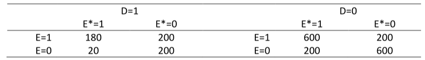
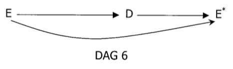
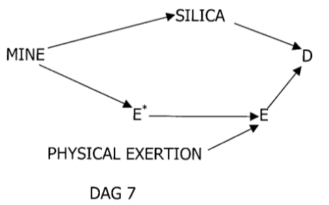
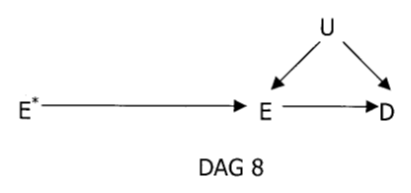

```{r setup, include=FALSE, warning=FALSE, results=FALSE}
knitr::opts_chunk$set(out.width = "50%")
library(tidyverse)
library(kableExtra)
options(knitr.table.format = "html")
```

## Introduction

In this practical you need to draw a DAG for each of 3 scenarios and then decide what model to fit.

We will use the same data for each scenario. The data is given in the table below.

```{r, echo=FALSE, include=TRUE}

```

```{r, echo=TRUE, results=FALSE, include=FALSE}
library(foreign)
dat <- read.dta("data/confounding-dags-practical.dta")
```

First, we perform some estimation so that you know the associations between the 3 variables $E$, $E^*$, and $D$.

```{r, include=FALSE}
str(dat)
names(dat)
table(dat$e[dat$d == 1], dat$es[dat$d == 1])
table(dat$e[dat$d == 0], dat$es[dat$d == 0])
```

* Estimating the marginal odds ratio for the association between $E$ on $D$ (i.e., using $D$ as the outcome/dependent variable and $E$ as the covariate)

```{r}
dat %>%
  glm(d ~ e, family = binomial, data = .) %>%
  {cbind(coef(.), confint.default(.))} %>%
  exp() %>%
  round(., digits = 2) %>%
  kbl() %>%
  kable_styling(full_width = FALSE)
```

* Estimating the conditional odds ratio for the association between $E$ and $D$ adjusting for/conditioning on $E^*$

```{r}
dat %>%
  glm(d ~ e + es, family = binomial, data = .) %>%
  {cbind(coef(.), confint.default(.))} %>%
  exp() %>%
  round(., digits = 2) %>%
  kbl() %>%
  kable_styling(full_width = FALSE)
```

<!-- * Showing that we get equivalent ORs in both `es` subgroups -->

<!-- ```{r} -->
<!-- dat %>% -->
<!--   group_by(es) %>% -->
<!--   group_modify(~ broom::tidy(glm(d ~ e, family = binomial, data = .x),  -->
<!--                              conf.int = TRUE, exponentiate = TRUE)) %>% -->
<!--   select(es, term, estimate, conf.low, conf.high) %>% -->
<!--   mutate_at(vars(c("estimate", "conf.low", "conf.high")), round, 2) -->
<!-- ``` -->

* Estimating the marginal odds ratio for the association between $E^*$ and $D$

```{r}
dat %>%
  glm(d ~ es, family = binomial, data = .) %>%
  {cbind(coef(.), confint.default(.))} %>%
  exp() %>%
  round(., digits = 2) %>%
  kbl() %>%
  kable_styling(full_width = FALSE)
```

## Question
You are given 3 scenarios from which the data could have been obtained. For each scenario we wish to estimate the effect of $E$ on $D$.

- Draw a DAG for each scenario
- Once you have drawn your DAG check that it conforms to the conditional independencies which were estimated above
- Use your DAG to write down model would you fit to estimate the effect of $E$ on $D$ in each scenario


### Scenario 1

- The data come from a case-control study
-	The aetiological question of interest is whether exposure to a particular nonsteroidal anti-inflammatory drug during the first trimester of pregnancy causes a congenital defect ($D$) arising in the second trimester
-	$D=1$ for cases, $D=0$ for controls without the defect
-	The sampling fraction for controls is unknown
-	$E^*$ is use of the drug of interest during the first trimester, as self-reported by the mother 1 month postpartum
-	$E$ is use of the drug of interest as recorded in comprehensive, accurate medical records of 1st trimester medications
-	You can ignore including any other possible confounders or other drug exposures

```{asis, include=params$include}
<details>
<summary></summary>
```
```{r, echo=FALSE, include=params$include}

```

```{asis, include=params$include}
- The model to fit is the marginal model of $D$ regressed upon $E$. We do not need to adjust for $E^*$ which would be a collider in this model
- The arrow from $E \rightarrow D$ must go in this directions because the medical records were created in the first trimester, before the development of the defect in the second trimester
- Taking a medicine will cause a woman to report taking it hence $E \rightarrow E^*$
- Since woman's self-report $E^*$ is obtained after birth then the arrow goes from $D$ to $E^*$. We know this marginal association exists in the data.
</details>
```

### Scenario 2

-	The data come from a prospective cohort study
-	$D$ is all-cause mortality in a cohort of healthy male miners, all aged 25 years, all of whom worked underground in a variety of different mine shafts for 6 months in 1967
-	40 year follow-up is complete. The aetiologic question is whether pulmonary exposure to doses of radon above a certain level causes increased mortality
-	For each miner, the air level of radon in his mine was measured ($E^*$)
-	A subject’s actual exposure depends on the level of radon in the mine and the physical demands of the job and this was measured by lung dosimetry ($E$: 0 = below threshold of interest, 1 = above)
-	It is known that 6 months of physical exertion at age 25 years has no independent effect on subsequent mortality

```{asis, include=params$include}
<details>
<summary></summary>
```
```{r, echo=FALSE, include=params$include}

```

```{asis, include=params$include}
- The model to fit is $D$ regressed upon $E$ and $E^*$
- Adjustment for $E^*$ is required to block the backdoor pathway $E \leftarrow E^* \leftarrow$ Mine $\rightarrow$ Silica $\rightarrow D$
</details>
```

### Scenario 3

-	The data come from a randomized controlled trial
-	$D$ is death over a 15 year period
-	Study subjects were randomly assigned to an educational intervention to encourage them to eat a low fat diet ($E^*=1$ for intervention, $E^*=0$ for control)
-	Investigators subsequently measured diet accurately in all trial participants ($E=1$ for low fat diet, $E=0$ for non-low fat diet)
-	Assume the intervention has no effect on $D$ other than through its effect on actual fat consumption $E$

```{asis, include=params$include}
<details>
<summary></summary>
```
```{r, echo=FALSE, include=params$include}

```

```{asis, include=params$include}
- Given this DAG the marginal association between $E^*$ and $D$ gives us the best estimate of the true assocation between $E$ and $D$
- This is because $E^*$ is independent of the possible confounding factors between the non-randomly allocated $E$ and $D$
- This is the DAG for an instrumental variable analysis
- Use of randomized treatment status to correct for non-compliance has used as an instrumental variable to estimate treatment effects in the analysis of clinical trials
</details>

<details>
<summary></summary>
These questions and answers are taken from: Robins JM. Data, Design, and Background Knowledge in Etiologic Inference, Epidemiology, 2001, 11, 313--320. https://doi.org/10.1097/00001648-200105000-00011
</details>
```
