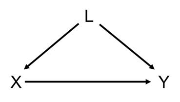
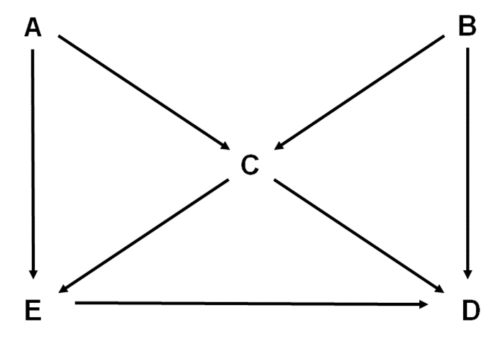

```{r setup, include=FALSE, warning=FALSE, results=FALSE}
knitr::opts_chunk$set(out.width="50%")
library(tidyverse)
require(dagitty)
require(Hmisc)
require(ggdag)
require(DiagrammeR)
```

`r Hmisc::hidingTOC(levels = 3)`

## Refresher

Notation: exposure $X$, outcome $Y$

* Pathway

```{r, echo=FALSE}
DiagrammeR::grViz("
      digraph mediator {
      graph [rankdir=TB]
      node [shape=plaintext, height=0.3, width=0.3]
      X 
      Y 
      { rank = same; X Y }
      X -> Y [minlen=3]
      }
      ", height = 75)
```

* Mediator:

```{r, echo=FALSE}
DiagrammeR::grViz("
      digraph mediator {
      graph [rankdir=TB]
      node [shape=plaintext, height=0.3, width=0.3]
      X 
      M [label='Mediator']
      Y 
      { rank = same; X M Y }
      X -> M [minlen=3]
      M -> Y [minlen=3]
      }
      ", height = 75)
```

* Backdoor pathway (first arrow goes wrong way from start point): $X$--$L$--$Y$

```{r, echo=FALSE}
DiagrammeR::grViz("
      digraph confounder {
      graph [rankdir=TB]
      node [shape=plaintext, height=0.3, width=0.3]
      X 
      L 
      Y 
      { rank = same; X Y }
      L -> X 
      L -> Y 
      }
      ", height = 200)
```

* Collider

```{r, echo=FALSE}
DiagrammeR::grViz("
      digraph collider {
      graph [rankdir=TB]
      node [shape=plaintext, height=0.3, width=0.3]
      X 
      Z [label='Collider']
      Y 
      { rank = same; X Y }
      X -> Z 
      Y -> Z 
      }
      ", height = 200)
```


A pathway is closed if

- Adjust for a variable that's not a collider on the pathway
- There's a collider on the pathway  

## Question 1

These questions were inspired by material given by Prof M. A. Hernan.

### a) 

What is the triangle definition of a confounder -- it has three criteria

```{r, echo=FALSE}
DiagrammeR::grViz("
      digraph confounder {
      graph [rankdir=TB]
      node [shape=plaintext, height=0.3, width=0.3]
      X 
      L [label='Confounder']
      Y 
      { rank = same; X Y }
      L -> X 
      L -> Y 
      X -> Y [minlen=3]
      }
      ", height = 200)
```

A confounder is

1.  
2.  
3.  

<details>
<summary></summary>
1. associated with the exposure
2. associated with the outcome conditional on the exposure
3. not on the causal pathway between the exposure and outcome
</details>

### b) 

What is Pearl's definition of confounding?

<details>
<summary></summary>
There is confounding of the exposure and outcome relationship when there is an open backdoor pathway between them (therefore, a confounder is any variable on an open backdoor pathway between an exposure and outcome.)
</details>

### c) 

For each of the following DAGs assess whether 

- $L$ is confounder under the triangle definition of a confounder (assess each of the 3 criteria) 
- and whether there is confounding under Pearl's definition

#### DAG A

```{r, echo=FALSE, include=TRUE}

```

<details>
<summary></summary>
- Triangle definition:
  1. Yes, $L$ is associated with the exposure, $L$--$X$
  2. Yes, $L$ is associated with the outcome conditional upon the exposure, $L$--$Y$
  3. Yes, $L$ is not on the causal pathway between the exposure and outcome  
  Overall: Yes, $L$ is a confounder
- Pearl: Yes, there is confounding since $X$--$L$--$Y$ is an open backdoor pathway
</details>

#### DAG B

```{r, echo=FALSE, include=TRUE}
knitr::include_graphics("./img/dag-backdoor-path-2-vars.png")
```

<details>
<summary></summary>
- Triangle definition: 
  1. Yes, $L$ is associated with the exposure, $L$--$X$
  2. Yes, $L$ is associated with the outcome conditional upon the exposure, $L$--$U$--$Y$
  3. Yes, $L$ is not on the causal pathway between the exposure and outcome  
  Overall: Yes, $L$ is a confounder  
- Pearl: Yes there is confounding of $X$--$Y$ relationship because $X$--$L$--$U$--$Y$ is an open backdoor pathway
</details>

#### DAG C

```{r, echo=FALSE, include=TRUE}
knitr::include_graphics("./img/dag-backdoor-path-with-confounder.png")
```

<details>
<summary></summary>
- Triangle definition: 
  1. Yes, $L$ is associated with the exposure, $L$--$U$--$X$
  2. Yes, $L$ is associated with the outcome conditional upon the exposure, $L$--$Y$
  3. Yes, $L$ is not on the causal pathway between the exposure and outcome  
  Overall: Yes, $L$ is a confounder
- Pearl: Yes there is confounding of the $X$--$Y$ relationship because $X$--$U$--$L$--$Y$ is an open backdoor pathway.
</details>

#### DAG D

```{r, echo=FALSE, include=TRUE}
knitr::include_graphics("./img/dag-backdoor-path-u1-u2.png")
```

<details>
<summary></summary>
- Triangle definition: 
  1. Yes, $L$ is associated with the exposure, $L$--$U_2$--$X$ is an open path
  2. Yes, $L$ is associated with the outcome conditional upon the exposure, $L$--$U_1$--$Y$ is an open path
  3. Yes, $L$ is not on the causal pathway between $X$ and $Y$  
  Overall: Yes, $L$ is a confounder
- Pearl: **No**! There is no confounding of the $X$--$Y$ relationship because $X$--$U_2$--$L$--$U_1$--$Y$ is a closed pathway. Under *d*-separation (directional-separation) rules $L$ is a collider of $U_1$ and $U_2$. Hence, without adjustment for the $L$ the path is closed. Including $L$ in a model will open the path between $U_1$ and $U_2$ which would bias the association between $X$ and $Y$, since $X$--$U_2$--$U_1$--$Y$ would be an open backdoor path. Hence, under the *d*-separation rules we don't want to adjust for $L$, even though we consider it to be a confounder under the triangle definition. 
    
*Takeaway message: the triangle definition of a confounder breaks down when there is a collider on a backdoor pathway*
</details>

## Question 2

The following DAG describes a model between an exposure ($E$), a disease outcome ($D$), and three other variables ($A$, $B$, and $C$).

```{r, echo=FALSE, include=TRUE}

```

### a) 

List all the (both open and closed) backdoor pathways between $E$ and $D$.

<details>
<summary></summary>
- $E$--$C$--$D$
- $E$--$C$--$B$--$D$
- $E$--$A$--$C$--$D$
- $E$--$A$--$C$--$B$--$D$
</details>

### b) 

With respect to $A$ and $B$ how would you describe $C$?

<details>
<summary></summary>
$C$ is a collider with respect to $A$ and $B$.
</details>
    
### c) 

If we fitted a regression model using $B$ as the outcome regressed on covariates $A$ and $C$, what could be the problem?
    
<details>
<summary></summary>
Since $C$ is a collider of $A$ and $B$, fitting such a model would be biased due to adjustment for a collider.
</details>

### d) 

Suppose we want to estimate the effect of $E$ on $D$, is there one best model to estimate this association? Write down the best model/s

<details>
<summary></summary>
There are several models which block all potential backdoor pathways. These are:
    
- Adjusting for $C$ and $A$
- Adjusting for $C$ and $B$
- Adjusting for $C$ and $A$ and $B$
    
Given that we must include in $C$ we must then include one or both of $A$ and $B$ to block the $A$--$B$ pathway which is opened by adjusting for $C$.

There's an argument to be made for adjusting for no variables as the bias induced by adjusting for $C$ could be worse than the $X$--$C$--$Y$ pathway.
</details>

### e) 

Verify your answers using the **dagitty**/**ggdag** packages in R (or the dagitty web app [here](http://dagitty.net/dags.html)).

<details>
<summary></summary>
```{r}
library(dagitty)
library(ggdag)
theme_set(theme_dag())

g <- dagitty('dag {
  E <- A -> C <- B -> D
  E -> D
  C -> E
  C -> D
  E [exposure, pos="0,2"]
  D [outcome, pos="2,2"]
  A [pos="0,0"]
  B [pos="2,0"]
  C [pos="1,1"]
}')
plot(g) 
```

```{r, include=FALSE}
gd <- tidy_dagitty(g)
ggdag(gd)
```

```{r}
library(ggdag)
theme_set(theme_dag())

butterfly_bias(x = "E", y = "D", a = "A", m = "C", b = "B",
               x_y_associated = TRUE) %>% 
  ggdag(use_labels = "label", text = FALSE)
```

```{r}
paths(g, "E", "D")
```

Which paths remain open when conditioning on C.

```{r}
paths(g, "E", "D", c("C"))
```

```{r}
impliedConditionalIndependencies(g)
```

What do we need to adjust for to estimate the effect of E on D?

```{r}
adjustmentSets(g)
```

*Important: dagitty misses the third solution:* `{ A, B, C }`
</details>

## Applied example

<details>
<summary></summary>

```{r, echo=FALSE}
knitr::include_graphics("./img/lederer-aats-2019-fig-1d-mbias.png")
```

- The orange arrows represent a closed back-door path: chronic beta-blocker therapy $\leftarrow$ heart failure $\rightarrow$ Crkles $\leftarrow$ Pneumonia $\rightarrow$ acute respiratory distress syndrome (ARDS).
- Crackles stands for auscultatory crackles: https://en.wikipedia.org/wiki/Crackles
- Crackles is a collider that naturally leaves the back-door path closed. However, control for crackles would open the back-door path, introducing confounding through the path (beta-blocker -- heart failure -- pneumonia -- ARDS).
- M-bias: bias induced by adjusting for a variable on a backdoor pathway which is a collider on that pathway.

We can modify the DAG to show that we don't need to adjust under an M structure.

```{r}
g2 <- dagitty('dag {
  E <- A -> C <- B -> D
  E -> D
  E [exposure, pos="0,2"]
  D [outcome, pos="2,2"]
  A [pos="0,0"]
  B [pos="2,0"]
  C [pos="1,1"]
}')
plot(g2)
```

```{r}
adjustmentSets(g2)
```

The adjustment set is the empty set, i.e., don't adjust for any covariates.
</details>
