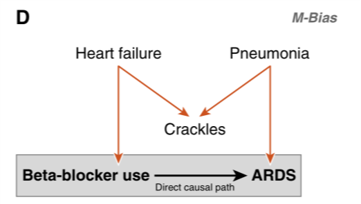

<style type="text/css">.toc-level-select-group{clear:both}#TOC{position:fixed;top:0;right:0;margin:23px 20px 20px 20px;z-index:9}#toc-controls{position:fixed;top:0;right:0;margin:0px}.col-md-3{width: 0%}.col-md-9{width: 100%}div.container-fluid.main-container{max-width:none;margin-left:0px;margin-right:none}</style><script>function toggleTOC(){$("#TOC").toggle();$(".toc-level-select-group").toggle()}function expandLevel1(){$("#TOC").toggle(true);$(".tocify-subheader").toggle(false)}function expandLevel2(){$("#TOC,.tocify-subheader").toggle(true)}</script><div id="toc-controls"><button type="button" id="toc-toggle" class="btn btn-default btn-xs toc-folding-btn pull-right" onclick="toggleTOC()">Contents</button><br/><div class="toc-level-select-group pull-right"><button id="toc-expand-level1" type="button" class="btn btn-default btn-xs toc-collapsing-btn pull-right" onclick="expandLevel1()">1</button><br/><button id="toc-expand-level2" type="button" class="btn btn-default btn-xs toc-collapsing-btn pull-right" onclick="expandLevel2()">2</button></div></div>


# Question 1

In this question we are attempting to estimate the effect of an exposure $X$ on and outcome $Y$.

a) What is the old/traditional/triangle definition of a confounder -- it has three points

    <details>
    <summary></summary>
    - associated with the exposure
    - associated with the outcome conditional on the exposure
    - not on the causal pathway between the exposure and outcome
    </details>

b) What is Pearl's definition of confounding?

    <details>
    <summary></summary>
    There is confounding of the exposure and outcome relationship when there is an open backdoor pathway between them. Therefore, a     confounder is any variable on a backdoor pathway between an exposure and an outcome.
    </details>

c) For each of the following DAGs assess whether $L$ is confounder under the triangle definition of a confounder and whether there is confounding under Pearl's definition.

DAG A


- Traditional definition: Yes/No
- Pearl's definition: Yes/No

<details>
<summary></summary>
- Triangle: Yes. $L$ is a confounder under the triangle definition
  - associated with the exposure, $L$--$X$
  - associated with the outcome conditional upon the exposure, $L$--$Y$
  - not on the causal pathway between the exposure and outcome
- Pearl: Yes. There is confounding since $X$--$L$--$Y$ is an open backdoor pathway
</details>

DAG B


<details>
<summary></summary>
- Triangle: Yes. $L$ is a confounder, it is
  - associated with the exposure, $L$--$X$
  - associated with the outcome conditional upon the exposure, $L$--$U$--$Y$
  - not on the causal pathway between the exposure and outcome
- Pearl: Yes. $X$--$L$--$U$--$Y$ is an open backdoor pathway
</details>

DAG C


<details>
<summary></summary>
- Triangle: Yes.
$L$ is a confounder, it is
  - associated with the exposure, $L$--$U$--$X$
  - associated with the outcome conditional upon the exposure, $L$--$Y$
  - not on the causal pathway between the exposure and outcome
- Pearl: Yes. $X$--$U$--$L$--$Y$ is an open backdoor pathway.
</details>

DAG D


<details>
<summary></summary>
- Triangle: Yes. $L$ is a confounder because it is
  - associated with the exposure, $L$--$U_2$--$X$ is an open path
  - associated with the outcome conditional upon the exposure, $L$--$U_1$--$Y$ is an open path
  - not on the causal pathway between $X$ and $Y$
- Pearl: **No**! Under *d*-separation (directional-separation) rules $L$ is a collider of $U_1$ and $U_2$. Hence, including $L$ in a model will open the path between $U_1$ and $U_2$ which would bias the association between $X$ and $Y$. Hence, under the     *d*-separation rules we don't want to adjust for $L$, even though we consider it to be a confounder under the old rules.
    
*Takeaway message: the triangle definition of a confounder breaks down when there is a collider on a backdoor pathway*
</details>

# Question 2

The following DAG describes a model between an exposure ($E$), a disease outcome ($D$), and three other variables ($A$, $B$, and $C$).


a) List all the (both open and closed) backdoor pathways between $E$ and $D$.

    <details>
    <summary></summary>
    - $E$--$C$--$D$
    - $E$--$C$--$B$--$D$
    - $E$--$A$--$C$--$D$
    - $E$--$A$--$C$--$B$--$D$
    </details>

b) With respect to $A$ and $B$ how would you describe $C$?

    <details>
    <summary></summary>
    $C$ is a collider with respect to $A$ and $B$.
    </details>
    
c) If we fitted a regression model using $B$ as the outcome regressed on covariates $A$ and $C$, what could be the problem?
    
    <details>
    <summary></summary>
    Since $C$ is a collider of $A$ and $B$, fitting such a model would be biased due to adjustment for a collider.
    </details>

d) Suppose we want to estimate the effect of $E$ on $D$, is there one best model to estimate this association? Write down the best model/s.

    <details>
    <summary></summary>
    There are several models which block all potential backdoor pathways. These are:
    
    - Adjusting for $C$ and $A$
    - Adjusting for $C$ and $B$
    - Adjusting for $C$ and $A$ and $B$
    
    Given that we must include in $C$ we must then include one or both of $A$ and $B$ to block the $A$-$B$ pathway which is opened by adjusting for $C$.
    </details>

e) Verify your answers using the **dagitty**/**ggdag** packages in R.

    <details>
    <summary></summary>
    
    ```r
    library(dagitty)
    library(ggdag)
    theme_set(theme_dag())
    
    g <- dagitty('dag {
      E <- A -> C <- B -> D
      E -> D
      C -> E
      C -> D
      E [exposure, pos="0,2"]
      D [outcome, pos="2,2"]
      A [pos="0,0"]
      B [pos="2,0"]
      C [pos="1,1"]
    }')
    plot(g) 
    ```
    
    
    
    
    ```r
    gd <- tidy_dagitty(g)
    ggdag(gd)
    ```
    
    
    
    
    ```r
    library(ggdag)
    theme_set(theme_dag())
    
    butterfly_bias(x = "E", y = "D", a = "A", m = "C", b = "B",
                   x_y_associated = TRUE) %>% 
      ggdag(use_labels = "label", text = FALSE)
    ```
    
    
    
    
    ```r
    paths(g, "E", "D")
    ```
    
    ```
    ## $paths
    ## [1] "E -> D"                "E <- A -> C -> D"      "E <- A -> C <- B -> D"
    ## [4] "E <- C -> D"           "E <- C <- B -> D"     
    ## 
    ## $open
    ## [1]  TRUE  TRUE FALSE  TRUE  TRUE
    ```
    
    Which paths remain open when conditioning on C.
    
    
    ```r
    paths(g, "E", "D", c("C"))
    ```
    
    ```
    ## $paths
    ## [1] "E -> D"                "E <- A -> C -> D"      "E <- A -> C <- B -> D"
    ## [4] "E <- C -> D"           "E <- C <- B -> D"     
    ## 
    ## $open
    ## [1]  TRUE FALSE  TRUE FALSE FALSE
    ```
    
    
    ```r
    impliedConditionalIndependencies(g)
    ```
    
    ```
    ## A _||_ B
    ## A _||_ D | B, C, E
    ## B _||_ E | A, C
    ```
    
    What do we need to adjust for to estimate the effect of E on D?
    
    
    ```r
    adjustmentSets(g)
    ```
    
    ```
    ## { B, C }
    ## { A, C }
    ```
    
    *Important: dagitty misses the third solution to the M-DAG problem:* `{A, B, C}`
    </details>

# Applied example

<details>
<summary></summary>



- The orange arrows represent a closed back-door path: chronic beta-blocker therapy $\leftarrow$ heart failure $\rightarrow$ Crkles $\leftarrow$ Pneumonia $\rightarrow$ acute respiratory distress syndrome (ARDS).
- Crackles stands for auscultatory crackles: https://en.wikipedia.org/wiki/Crackles
- Crackles is a collider that naturally leaves the back-door path closed. However, control for crackles would open the back-door pa, introducing confounding through the path (beta-blocker -- heart failure -- pneumonia -- ARDS).
- M-bias: bias induced by adjusting for a variable on a backdoor pathway which is a collider on that pathway.

We can modify the DAG to show that we don't need to adjust under an M structure.


```r
g2 <- dagitty('dag {
  E <- A -> C <- B -> D
  E -> D
  E [exposure, pos="0,2"]
  D [outcome, pos="2,2"]
  A [pos="0,0"]
  B [pos="2,0"]
  C [pos="1,1"]
}')
plot(g2)
```


```r
adjustmentSets(g2)
```

```
##  {}
```

The adjustment set is the empty set, i.e., don't adjust for any covariates.
</details>
