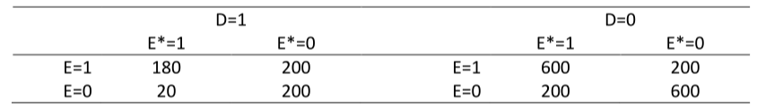
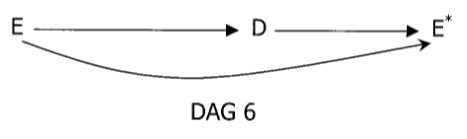
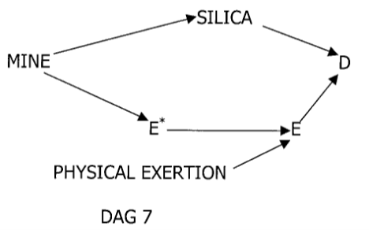

```{r setup, include=FALSE, warning=FALSE, results=FALSE}
knitr::opts_chunk$set(include = TRUE)
def.chunk.hook  <- knitr::knit_hooks$get("chunk")
knitr::knit_hooks$set(chunk = function(x, options) {
  x <- def.chunk.hook(x, options)
  ifelse(options$size != "normalsize", paste0("\n \\", options$size,"\n\n", x, "\n\n \\normalsize \n"), x)
})
library(tidyverse)
```

# Introduction

In this practical you need to try and draw a DAG for 3 scenarios.

We will use the same data for each scenario. The data is given in the table below.

```{r, echo=FALSE, include=TRUE}

```

The data is in the file `confounding-dags-practical.dta`. The `.dta` extension means it is in Stata format, and so read it into R using the code below.

```{r, echo=TRUE, results=FALSE, include=TRUE}
library(foreign)
dat <- read.dta("confounding-dags-practical.dta")
```

# Question 1

First perform some estimation so that you know the associations between the 3 variables $E$, $E^*$, and $D$.

a) In R recreate the table above. You may need to produce two smaller tables to do this.

```{r}
str(dat)
names(dat)
table(dat$e[dat$d==1], dat$es[dat$d==1])
table(dat$e[dat$d==0], dat$es[dat$d==0])
```

b) What is the marginal odds ratio for the effect of $E$ on $D$ (i.e. use $D$ as the outcome/dependent variable and $E$ as the covariate)?

```{r}
mod1 <- glm(d ~ e, family=binomial, data=dat)
summary(mod1)
exp(cbind(coef(mod1), confint.default(mod1)))
```

c) What is the conditional odds ratio for the association between $E$ and $D$ adjusting for $E^*$?

```{r}
mod2 <- glm(d ~ e + es, family=binomial, data=dat)
summary(mod2)
exp(cbind(coef(mod2), confint.default(mod2)))
```

```{asis}
And showing that you get equivalent ORs in both subgroups.
```
```{r}
summary(glm(d ~ e, subset=es==0, family=binomial, data=dat))
summary(glm(d ~ e, subset=es==1, family=binomial, data=dat))
```

d) What is the marginal odds ratio for the association between $E^*$ and $D$?

```{r}
mod3 <- glm(d ~ es, family=binomial, data=dat)
summary(mod3)
exp(cbind(coef(mod3), confint.default(mod3)))
```

# Question 2: main task
Next you are given 3 scenarios from which the data could have been obtained. For each scenario we wish to estimate the effect of $E$ on $D$.

- Draw a DAG for each scenario.
- Once you have drawn your DAG check that it conforms to the conditional independencies which you can estimate in the data.
- What model would you fit to estimate the effect of $E$ on $D$ in each scenario?

\newpage

# Scenario 1

- The data come from a case-control study.
-	The aetiological question of interest is whether exposure to a particular nonsteroidal anti-inflammatory drug during the first trimester of pregnancy causes a congenital defect ($D$) arising in the second trimester.
-	$D=1$ for cases, $D=0$ for controls without the defect.
-	The sampling fraction for controls is unknown.
-	$E^*$ is use of the drug of interest during the first trimester, as self-reported by the mother 1 month postpartum.
-	$E$ is use of the drug of interest as recorded in comprehensive, accurate medical records of 1st trimester medications.
-	You can ignore including any other possible confounders or other drug exposures.

```{asis}
These questions and answers are taken from Robins, Data, Design, and Background Knowledge in Etiologic Inference, Epidemiology, 2001, 11, 313--320.
```
```{r, echo=FALSE}

```

```{asis}
- The model to fit is the marginal model of $D$ regressed upon $E$. We do not need to adjust for $E^*$ which would be a collider in this model.
- The arrow from E-D must go in this directions because the medical records were created in the first trimester, before the development of the defect in the second trimester.
- Taking a medicine will cause a woman to report taking it hence $E-E^*$
- Since woman's self-report $E^*$ is obtained after birth then the arrow goes from D to $E^*$. We know this marginal association exists in the data.
```

\newpage

# Scenario 2

-	The data come from a prospective cohort study. 
-	$D$ is all-cause mortality in a cohort of healthy male miners, all aged 25, all of whom worked underground in a variety of different mine shafts for 6 months in 1967. 
-	40 year follow-up is complete. The aetiologic question is whether pulmonary exposure to doses of radon above a certain level causes increased mortality. 
-	For each miner, the air level of radon in his mine was measured ($E^*$).
-	A subject’s actual exposure depends on the level of radon in the mine and the physical demands of the job and this was measured by lung dosimetry ($E$: 0 = below threshold of interest, 1= above). 
-	It is known that 6 months of physical exertion at age 25 has no independent effect on subsequent mortality.

```{r, echo=FALSE}

```
```{asis}
- The model to fit is $D$ regressed upon $E$ and $E^*$.
- Adjustment for $E^*$ is required to block the backdoor pathway $E-E^*-\text{Mine}-\text{Silica}-D$.
```

\newpage

# Scenario 3

-	The data come from a randomized controlled trial.
-	D is death over a 15 year period. 
-	Study subjects were randomly assigned to an educational intervention to encourage them to eat a low fat diet ($E^*=1$ for intervention, $E^*=0$ for control).
-	Investigators subsequently measured diet accurately in all trial participants ($E=1$ for low fat diet, $E=0$ for non-low fat diet).
-	Assume the intervention has no effect on $D$ other than through its effect on actual fat consumption $E$.

```{r, echo=FALSE}
knitr::include_graphics("./img/practical-2b-robins-dags-dag-8.png")
```

```{asis}
- Given this DAG the marginal association between $E^*$ and $D$ gives us the best estimate of the true assocation between $E$ and $D$.
- This is because $E^*$ is independent of the possible confounding factors between the non-randomly allocated $E$ and $D$.
- This is the DAG for an instrumental variable analysis.
- Use of randomized treatment status to correct for non-compliance is commonly used as an instrumental variable to estimate treatment effects in medical statistics.
```
